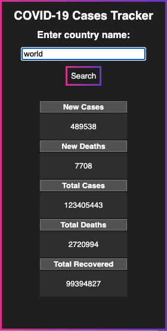

  

<h1 align="center"><Covid-19 Cases Tracker</h1>
COVID-19 Cases Tracker

## Introduction
A Google Chrome extension that tracks COVID-19 Cases. It allows you to access the latest COVID-19 cases information for any given country, no matter what you're doing or what tab you're on. I've always wanted to experiment with a chrome extension and given the ongoing pandemic, figured I'd make it useful and relevant.

## Features
Once you enter the name of the country you'd like stats for, you are met with a table that lists the following:
* New Cases
* New Cases
* Total Cases
* Total Deaths
* Total Recovered

## Installation
As this extension is not published, the installation is manual.
1. Clone repository
3. Navigate to Chrome Extensions from your browser settings
4. Enable Developer mode, located on the top right corner of the Extensions page
5. Click the 'Load unpacked' on the top left corner and select the downloaded repo

You're done! Now you can track COVID-19 cases at the click of a button.
If you'd like, you can pin the extension to your toolbar. 

## Interface
The interface uses a dark theme with a minimalistic approach, developed using css. 

  

